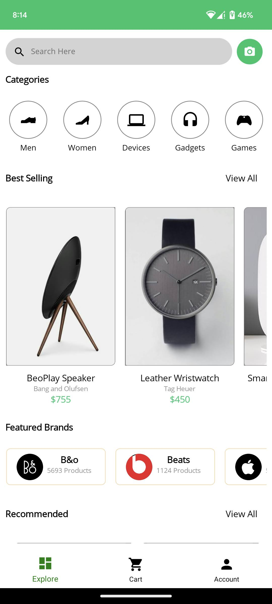
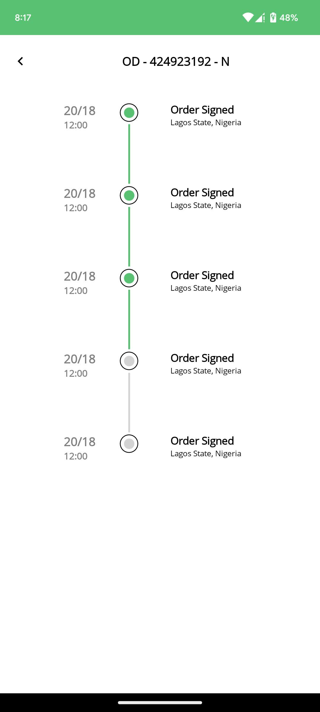

**Bu repoda XAML ile yazılmış örnek bir uygulamayı FmgLib.MauiMarkup kütüphanesi ile XAML kullanmadan yani C# Markup yazılma şeklini ve rahatlığını göstermeye çalıştık.**

**Uygulamanın gerçek sahibi XAML ile yazan:** [Santosh Dahal](https://github.com/exendahal)

 

**In this repository, we demonstrate how to write a sample application using FmgLib.MauiMarkup without XAML, highlighting the style and convenience of using C# Markup instead of XAML.**

**The original author of the application written with XAML is** [Santosh Dahal](https://github.com/exendahal).

## Ecommerce Design
Ecommerce design with NET MAUI (MVVM Pattern)

## Features
* ColletionView
* SwipeView
* MVVM
* Font Icon
* Borders
* Color gradient brushes
* Stepper

## Preview
 &nbsp;&nbsp;&nbsp; 
 &nbsp;&nbsp;&nbsp; 
  

### More information
- (XAML) Source code: [https://github.com/exendahal/EcommerceMAUI](https://github.com/exendahal/EcommerceMAUI)
- (No XAML / FmgLib.MauiMarkup) Source Code: [https://github.com/gonultasmf/ETicaret_Net_MAUI](https://github.com/gonultasmf/ETicaret_Net_MAUI)
